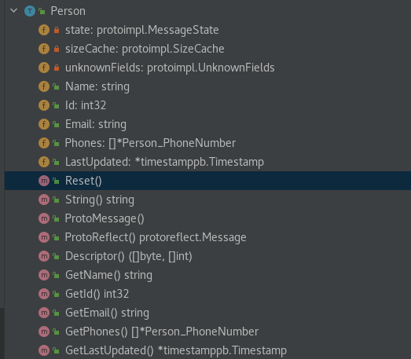

## protobuf demo

这篇文章记录一下测试[protobuf examples](https://github.com/protocolbuffers/protobuf/tree/main/examples)踩的坑。

## Prerequisite

### 安装protoc

- 访问[release page](https://github.com/protocolbuffers/protobuf/releases/tag/v21.10)下载`protoc-$tag-$distro-$arch.tar.gz`
- 解压tar.gz
- 将`protoc`二进制放到PATH下
- 将`include`目录放到`/usr/local/`

### 安装Go protoc plugin

```bash
$ go install google.golang.org/protobuf/cmd/protoc-gen-go@latest
```
### 设置PATH

```bash
$ export PATH=$PATH:$(go env GOPATH)/bin
```


## "google.protobuf.Timestamp" is not defined

```bash
google/protobuf/timestamp.proto: File not found.
addressbook.proto:13:1: Import "google/protobuf/timestamp.proto" was not found or had errors.
addressbook.proto:49:3: "google.protobuf.Timestamp" is not defined.
```

1. 确定/usr/local/include

```bash
[root@localhost examples]# tree /usr/local/include/
/usr/local/include/
└── google
    └── protobuf
        ├── any.proto
        ├── api.proto
        ├── compiler
        │   └── plugin.proto
        ├── descriptor.proto
        ├── duration.proto
        ├── empty.proto
        ├── field_mask.proto
        ├── source_context.proto
        ├── struct.proto
        ├── timestamp.proto # the timestamp type
        ├── type.proto
        └── wrappers.proto

3 directories, 12 files

```

2. protoc的参数中通过`-I`指定

修改Makefile中的`-I`参数

```bash
go/tutorialpb/addressbook.pb.go: addressbook.proto
	mkdir -p go/tutorialpb # make directory for go package
	protoc -I /usr/local/include -I . --go_opt=paths=source_relative --go_out=go/tutorialpb addressbook.proto
```

运行目标:

```bash
make go/tutorialpb/addressbook.pb.go
```

查看输出:

```bash
[root@localhost examples]# tree go
go
├── cmd
│   ├── add_person
│   │   ├── add_person.go
│   │   └── add_person_test.go
│   └── list_people
│       ├── list_people.go
│       └── list_people_test.go
├── go.mod
├── go.sum
└── tutorialpb
    └── addressbook.pb.go # protoc的输出

```

## Getter

自动生成的代码里有一堆Getter




## 测试protobuf


1. 编译go源码

```bash
make go
```
这会将`go/cmd/add_person`等编译为二进制，放到`examples`目录下

2. 测试序列化和反序列化

- 序列化

```bash
[root@localhost examples]# ./add_person_go addressbook.data
Enter person ID number: 23
Enter name: fada
Enter email address (blank for none): cssacd
```

- 反序列化

```bash
[root@localhost examples]# ./list_people_go addressbook.data
Person ID: 2
  Name: cicac
  E-mail address: oneslide
  Home phone #: 183234
Person ID: 23
  Name: fada
  E-mail address: cssacd
  Home phone #: 113241
  Home phone #: 23141234
```

## Advanced API usage


- example 1

看看`addressbook.pb.go`生成的这个函数:

```go
func (x *Person_PhoneNumber) ProtoReflect() protoreflect.Message {
	mi := &file_addressbook_proto_msgTypes[2]
	if protoimpl.UnsafeEnabled && x != nil {
		ms := protoimpl.X.MessageStateOf(protoimpl.Pointer(x))
		if ms.LoadMessageInfo() == nil {
			ms.StoreMessageInfo(mi)
		}
		return ms
	}
	return mi.MessageOf(x)
}
```

这个提供类似golang reflect包的功能，能够实现set字段的功能。

> 不知道为什么没有提供set

修改如下文件：

- list_people.go

```go
func listPeople(w io.Writer, book *pb.AddressBook) {

	book.ProtoReflect().Range(func(descriptor protoreflect.FieldDescriptor, value protoreflect.Value) bool {
		fmt.Println(descriptor.Name()) // => people
		fmt.Println(descriptor.Kind()) // => message
		

		value.List().Get(0).Message().Range(func(d protoreflect.FieldDescriptor, v protoreflect.Value) bool {
			fmt.Println(d.Name()) // => name
			fmt.Println(d.Kind()) // => string
			fmt.Println(v.String()) // => cicac
			value.List().Get(0).Message().Set(d,protoreflect.ValueOfString("hello world!!")) // => change "cicac" to "hello world"
			return false
		})
		return false
	})
	for _, p := range book.People {
		writePerson(w, p)
	}
}
```
重新运行一波：

```go
[root@localhost examples]# make go
cd go && go build -o ../list_people_go ./cmd/list_people
[root@localhost examples]# ./list_people_go addressbook.data
people
message
name
string
cicac
Person ID: 2
  Name: hello world!! # 这里修改为"hello world!!"了
  E-mail address: oneslide
  Home phone #: 183234

```


@echo off 

set PGPASSWORD=<yourpassword>

pgdump -U postgres ...