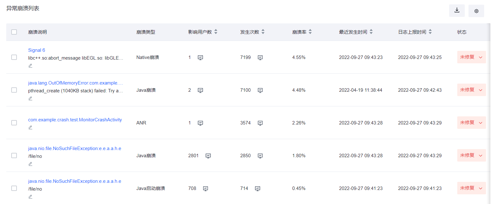
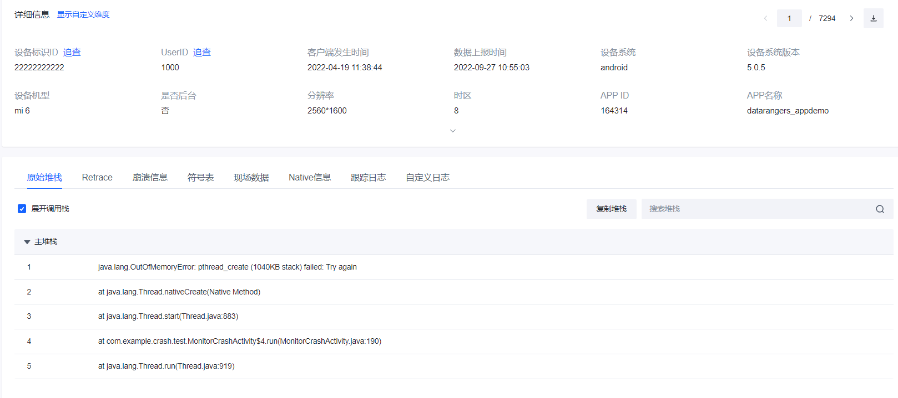
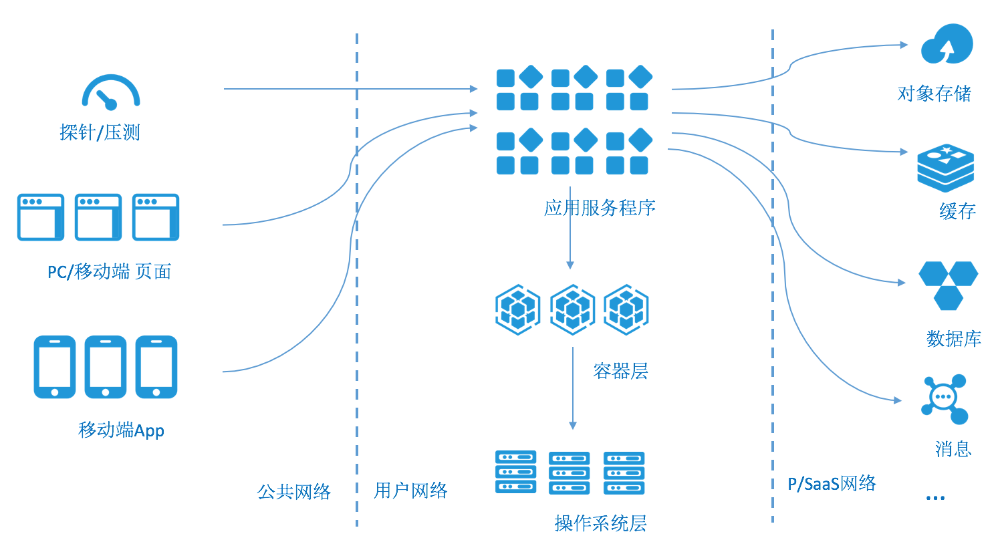

<!-- TOC -->

- [监控系统](#%E7%9B%91%E6%8E%A7%E7%B3%BB%E7%BB%9F)
    - [APMApplication Performance Management](#apmapplication-performance-management)
        - [APM简介](#apm%E7%AE%80%E4%BB%8B)
        - [APM监控重要信息](#apm%E7%9B%91%E6%8E%A7%E9%87%8D%E8%A6%81%E4%BF%A1%E6%81%AF)
            - [异常崩溃列表](#%E5%BC%82%E5%B8%B8%E5%B4%A9%E6%BA%83%E5%88%97%E8%A1%A8)
            - [自定义业务指标](#%E8%87%AA%E5%AE%9A%E4%B9%89%E4%B8%9A%E5%8A%A1%E6%8C%87%E6%A0%87)
    - [云原生时代应用监控](#%E4%BA%91%E5%8E%9F%E7%94%9F%E6%97%B6%E4%BB%A3%E5%BA%94%E7%94%A8%E7%9B%91%E6%8E%A7)
        - [部署模式](#%E9%83%A8%E7%BD%B2%E6%A8%A1%E5%BC%8F)
        - [解决方案](#%E8%A7%A3%E5%86%B3%E6%96%B9%E6%A1%88)
            - [PC/移动端页面监控](#pc%E7%A7%BB%E5%8A%A8%E7%AB%AF%E9%A1%B5%E9%9D%A2%E7%9B%91%E6%8E%A7)
            - [探针/压测](#%E6%8E%A2%E9%92%88%E5%8E%8B%E6%B5%8B)
            - [操作系统](#%E6%93%8D%E4%BD%9C%E7%B3%BB%E7%BB%9F)
            - [SASS服务](#sass%E6%9C%8D%E5%8A%A1)

<!-- /TOC -->
## 监控系统

监控系统是提高应用的可观测性(observability)

### APM(Application Performance Management)

#### APM简介
APM是指对应用程序的性能和可用性的监控管理。狭义上的APM单指应用程序的监控，如应用的各接口性能和错误监控，分布式调用链路跟踪，以及其他各类用于诊断(内存，线程等)的监控信息，等;

广义上的APM, 除了应用层的监控意外，还包括手机App端监控，页面端监控，容器、服务器监控，以及其他平台组件如中间件容器，数据库等层面的监控。

目前市面的系统基本都是参考 Google 的 Dapper（大规模分布式系统的跟踪系统）来做的, 参考[Dapper论文中文翻译](http://bigbully.github.io/Dapper-translation/).

开源的APM工具列表：

- [pinpoint](https://github.com/naver/pinpoint)

Pinpoint is an open source APM (Application Performance Management) tool for large-scale distributed systems written in Java.

- [skywalking](https://skywalking.apache.org/)

A distributed tracing system, and APM (Application Performance Monitoring).

- [zipkin](http://zipkin.io/)

Zipkin is a distributed tracing system. It helps gather timing data needed to troubleshoot latency problems in microservice architectures. It manages both the collection and lookup of this data. Zipkin’s design is based on the Google Dapper paper.

#### APM监控重要信息

说一个产品，要首先说它能提供什么主要能力。

其实大部分场景apm监控产出的大部分信息都是不太有用的，只有几个重要信息需要知道。

##### 异常崩溃列表

记录异常类型。

异常的原始堆栈:

##### 自定义业务指标

自定义业务指标的重要性不言而喻，有了这些指标，才能更好的理解并优化业务。

应用按类型有不同的自定义指标，比如对于对象存储(OSS),其重要的指标是对象下载/上传速度。

自定义业务指标的收集通常采用的方式是埋点上报。

### 云原生时代应用监控

#### 部署模式
运行在现今公有云上的典型应用：

- 应用一般对外提供两种客户端访问模式：移动端App访问和基于浏览器的页面访问。客户端的监控在APM领域又被称为UEM(User Experience Management)，即用户体验管理。
- 除了客户端访问以外，用户一般还会部署相应的业务探针，通过API来直接测试服务性能或进行健康检测。
- 对客户端直接提供服务的后端应用服务程序。基于微服务的应用一般多个应用，分别运行在多个节点之上，应用和应用之间会形成复杂调用链。

- 后端应用一般运行在容器里，或者直接运行在(虚拟)操作系统之上，取决于用户是否进一步使用容器技术来优化开发和运维。
- 应用还会直接依赖各类的PaaS/SaaS云服务，如OSS，OTS, MQ, RDS等对应用提供平台服务，简化应用的运维成本。

#### 解决方案

全链路的监控要求对部署图中的所有组件进行监控。当然每个组件的监控的实现方案略有不同。

##### PC/移动端页面监控

页面的JS埋点，主要监控包括：

1. 页面的调用次数和响应时间
2. API的调用时间和错误返回
3. 页面的JS错误

##### 探针/压测

公有云产商一般会使用遍布全国的互联网终端节点来模拟外部真实网络环境下的用户访问.

##### 操作系统

agent方式部署os监控软件。

##### SASS服务

一般自带监控功能和监控面板。